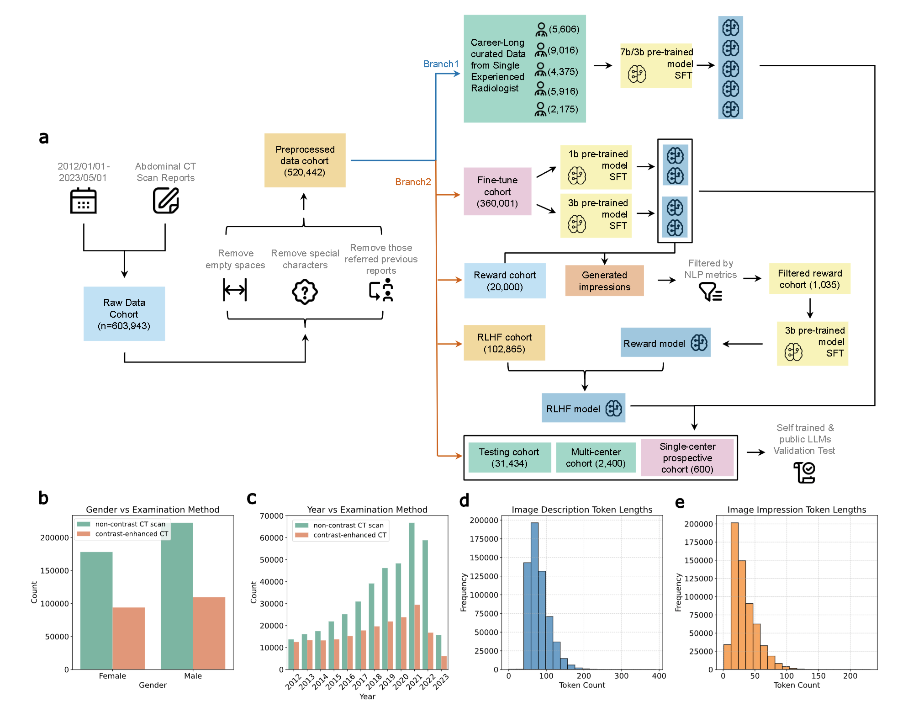

<div align="center">

## Overcoming Dataset Scarcity on Medical LLM Adaptation: Expert-Specific LLMs for Robust Radiology Impression Generation

</div>

<div align="center">

[](LICENSE)

</div>
As part of our efforts to advance the development of ChatGPT-style models, we leveraged **DeepSpeed Chat** to streamline and accelerate our work. DeepSpeed Chat offers an integrated system framework for training ChatGPT-like models end-to-end, which was crucial for our research. By using this platform, we were able to seamlessly take a pre-trained large language model and fine-tune it through an OpenAI InstructGPT-style process, producing high-quality models tailored for medical applications like radiology impression generation.[](https://)

As part of our efforts to advance the development of ChatGPT-style models, we leveraged **DeepSpeed Chat** to streamline and accelerate our work. DeepSpeed Chat offers an integrated system framework for training ChatGPT-like models end-to-end, which was crucial for our research. By using this platform, we were able to seamlessly take a pre-trained large language model and fine-tune it through an OpenAI InstructGPT-style process, producing high-quality models tailored for medical applications like radiology impression generation.

<div align="center">



</div>

<!-- Three language version (Eng/Chinese/Japanese)  -->

<!-- markdown-toc start - Don't edit this section. Run M-x markdown-toc-refresh-toc -->

## Table of Contents

- [Overview of DeepSpeed-Chat ](#-what-is-deepspeed-chat-)
- [ Quick Start ](#-quick-start-)
  - [ Installation](#-installation)
  - [ Single Script for Training 3-Step RLHF Pipeline](#-one-single-script-completes-all-three-stages-of-rlhf-training-and-generate-your-first-chatgpt-model)
  - [ Demonstration: Individual Step Fine-Tuning](#-demonstration-individual-step-fine-tuning)
    - [ Step 1 - Supervised Fine-Tuning](#-step-1---supervised-fine-tuning)
    - [ Step 2 - Reward Model](#-step-2---reward-model)
    - [ Step 3 - Reinforcement Learning with Human Feedback](#-step-3---reinforcement-learning-with-human-feedback)
  - [ Adding and using your own datasets in DeepSpeed-Chat](#-adding-and-using-your-own-datasets-in-deepspeed-chat)
  - [ Customizing RLHF training pipeline via DeepSpeed-Chat’s APIs](#-customizing-your-own-rlhf-training-pipeline-using-deepspeed-chats-rlhf-apis)
  - [ Serving Your Model: Plug-in and Test!](#-serving-plug-in-your-final-model-trained-by-deepspeed-chat-and-test-it-out)
- [ Training Performance Evaluation ](#-training-performance-evaluation-)
- [ Supported Models ](#-supported-models-)
- [ Documentation and Tutorial ](#-documentation-and-tutorial-)
- [ DeepSpeed Chat and DeepSpeed Community ](#-deepspeed-chat-and-deepspeed-community-)

<!-- markdown-toc end -->

## Overview of DeepSpeed-Chat

In our research, we leveraged the DeepSpeed-Chat framework to efficiently train and deploy large-scale models. This platform facilitated the training, fine-tuning, and deployment processes, ensuring both cost-effectiveness and scalability. For instance, we successfully trained a 1.3 billion parameter model in significantly less time compared to traditional methods, underscoring its pivotal role in our workflow.

This repository houses the code we employed to develop and fine-tune a ChatGPT-like model tailored for medical applications. We aim for it to be a valuable resource for fellow researchers interested in harnessing large language models in their work. DeepSpeed-Chat offers a comprehensive pipeline for Reinforcement Learning with Human Feedback (RLHF), enabling the seamless fine-tuning of pre-trained large language models through a structured three-step process:

1. **Supervised Fine-Tuning (SFT):** We initiated the process by fine-tuning a pre-trained model on a supervised dataset, allowing it to generate radiology impressions based on established examples.
2. **Reward Model Fine-Tuning:** Subsequently, we developed a reward model to assess the quality of the generated impressions, ensuring they met the desired standards.
3. **Reinforcement Learning with Human Feedback (RLHF):** Finally, we employed reinforcement learning, guided by human feedback, to further refine the model's outputs, enhancing its performance in generating accurate and contextually relevant radiology impressions.

By utilizing DeepSpeed-Chat's integrated system, we achieved efficient and scalable training, resulting in a high-quality model tailored for medical applications. This approach not only streamlined our development process but also ensured that our model could be effectively applied across various platforms and use cases.

## Quick Start

### Installation

```bash
pip install deepspeed>=0.9.0

git clone https://github.com/microsoft/DeepSpeedExamples.git
cd DeepSpeedExamples/applications/DeepSpeed-Chat/
pip install -r requirements.txt
```

### Official Example Script for Complete RLHF Training and ChatGPT Model Generation

&nbsp;&nbsp;**DeepSpeed-Chat's RLHF Example 1: Swift Training for a 1.3B ChatGPT Model**

For those with limited time, it's feasible to train a smaller model using DeepSpeed-Chat. We prepared a training example for a \*\*1.3B\*\* model with a single dataset to test our framework on consumer-grade GPUs. The advantage is that the model checkpoint will be ready for use after a short duration.

```bash
python train.py --actor-model facebook/opt-1.3b --reward-model facebook/opt-350m --deployment-type single_gpu
```

For those with approximately half a day and access to a single server node, we suggest using a pre-trained \*\*OPT-13B\*\* as the actor model and OPT-350M as the reward model. The following script facilitates the generation of a final 13B ChatGPT-style model:

```bash
python train.py --actor-model facebook/opt-13b --reward-model facebook/opt-350m --deployment-type single_node
```

### Demonstration: Individual Step Fine-Tuning

The train.py script has an easy-to-use command-line interface and can be launched with several arguments including model type, model size, and number of GPUs to run. Considering users who would like to use DeepSpeed-Chat to only fine-tune their pretrained models in Step 1 or 2, or just use their own actor and reward model checkpoints directly to perform Step 3 in our RLHF pipeline, DeepSpeed-Chat provides greater configurability and flexibility to accommodate individual step fine-tuning:

#### Step 1 - [Supervised Fine-Tuning](./training/step1_supervised_finetuning)

In our study, we leverage the pretrained model as follow:

| Pretrained Models | Parameter Size | Huggingface Model Link                        |
| ----------------- | -------------- | --------------------------------------------- |
| Bloomz-560m       | 559M params    | https://huggingface.co/bigscience/bloomz-560m |
| Bloomz-1b1        | 1.07B params   | https://huggingface.co/bigscience/bloomz-1b1  |
| Bloomz-3b         | 3B params      | https://huggingface.co/bigscience/bloomz-3b   |
| Bloomz-7b1        | 7.07B params   | https://huggingface.co/bigscience/bloomz-7b1  |

```bash

# Move into the first step of the pipeline

cd training/step1_supervised_finetuning/

# Run the training script

bash training_scripts/single_gpu/run_1.3b.sh

# Evaluate the model

bash evaluation_scripts/run_prompt.sh

```

#### Step 2 - [Reward Model](./training/step2_reward_model_finetuning)

```bash
# Move into the second step of the pipeline
cd training/step2_reward_model_finetuning

# Run the training script
bash training_scripts/run_350m.sh

# Evaluate the model
bash evaluation_scripts/run_eval.sh
```

#### Step 3 - [Reinforcement Learning with Human Feedback](./training/step3_rlhf_finetuning)

<p align="center">


Figure 1: The illustration of DeepSpeed Chat’s RLHF training pipeline with optional features.

</p>

As the most complex step of the entire 3-step InstructGPT pipeline, DeepSpeed Chat's **_Hyrbid Engine_** has enabled sufficient acceleration to aovid large training time (cost) implications. Refer to [Step3: Reinforcement Learning Human Feedback (RLHF)](./training/step3_rlhf_finetuning) for more information. If you already have your fine-tuned actor and reward model checkpoints, you can simply run the following scripts to enable the PPO training.

```bash
# Move into the final step of the pipeline
cd training/step3_rlhf_finetuning/

# Run the training script
bash training_scripts/single_gpu/run_1.3b.sh
```

### Adding and Using Custom Datasets in DeepSpeed-Chat

While preparing dataset in chinese, we format data in following format, please refer in paper for further details on how to set prefix and suffix:

| Intruction                           | Response                   |
| ------------------------------------ | -------------------------- |
| Prefix1 + Image descritpion + Suffix | Prefix2 + Image Impression |

On formating dataset from csv file to .arrow file, we use following code to convert and encode proper CHINESE content, for other languages, please alter for your target encoding format:

```bash
# Import proper Python package
from datasets import load_dataset

#load your data content from csv file and encode to gbk for CHINESE content
dataset = load_dataset('csv', data_files='path/to/your/csv/file.csv', delimiter=',', encoding='gbk')

dataset.save_to_disk('path/to/your/arrow/file.arrow')

#Validate if the generated arrow file is valid and include target content:
from datasets import load_from_disk

data=load_from_disk('./file.arrow')

print(data)
```

In our research, we extended DeepSpeed-Chat by integrating custom datasets alongside the example datasets provided. To achieve this, we followed a few steps. First, we defined a new class in [training/utils/data/raw_datasets.py](https://github.com/microsoft/DeepSpeedExamples/blob/master/applications/DeepSpeed-Chat/training/utils/data/raw_datasets.py) to specify the format for our dataset. It is essential to adhere to the structure and APIs defined in the `PromptRawDataset` class, as this ensures that the data format aligns with DeepSpeed-Chat's expected structure. We found reviewing the existing dataset classes to be helpful in understanding how to format and integrate new datasets.

Next, we updated the `get_raw_dataset` function in [training/utils/data/data_utils.py](https://github.com/microsoft/DeepSpeedExamples/blob/master/applications/DeepSpeed-Chat/training/utils/data/data_utils.py) to handle our newly defined dataset. Specifically, we added an if-condition for our custom dataset, where the `dataset_name` string matches the dataset name provided as an argument during training. Lastly, we included the dataset name in the `--data_path` argument in the training script.

It’s important to note that some datasets may contain only one response instead of two. In such cases, these datasets are suitable only for Step 1 of the training process, and should be included in the `--sft_only_data_path` argument instead of the `--data_path` argument. If your primary focus is on Step 1 (Supervised Fine-Tuning), adding more single-response datasets can be beneficial. However, if you intend to proceed with Steps 2 and 3, it is essential to avoid overloading the training with single-response datasets. Including too many may result in discrepancies between the data used across the steps, potentially causing training instability and degraded model performance. This is why we focused on datasets with two responses to ensure consistency throughout all three steps of the pipeline.

### Customizing Your Own RLHF Training Pipeline Using DeepSpeed-Chat’s RLHF APIs

DeepSpeed-Chat enables researchers to tailor their RLHF training pipelines with ease using its flexible APIs. In our work, we constructed our custom RLHF pipeline, allowing us to create a diverse set of RLHF algorithms for our research objectives.

```python
engine = DeepSpeedRLHFEngine(
  actor_model_name_or_path=args.actor_model_name_or_path,
  critic_model_name_or_path=args.critic_model_name_or_path,
  tokenizer=tokenizer,
  num_total_iters=num_total_iters,
  args=args)

trainer = DeepSpeedPPOTrainer(engine=engine, args=args)

for prompt_batch in prompt_train_dataloader:
  out = trainer.generate_experience(prompt_batch)
  actor_loss, critic_loss = trainer.train_rlhf(out)
```

The training numbers shown are based on Stage 3 of our experiments, where we trained on a curated dataset of 135M tokens, which were distributed across several open-source datasets. Specifically, we used datasets such as Dahoas/rm-static, Dahoas/full-hh-rlhf, and others, which accounted for 40% of the data used in the RLHF training stage. With this approach, we trained for one epoch on 67.5M query tokens and 67.5M generated tokens, optimizing the model at each step.

We advise future users to take note of these specifications when performing cost and time comparisons with DeepSpeed-RLHF, as the throughput and efficiency of training will depend on various factors like batch sizes, model families, and dataset configurations..

</p></details>
## Supported Models

Currently, Deepspeed-Chat support the following model families.

| model family                                                   | size range  |
| -------------------------------------------------------------- | ----------- |
| [opt](https://huggingface.co/models?other=opt)                 | 0.1B - 66B  |
| [bloom](https://huggingface.co/models?other=bloom)             | 0.3B - 176B |
| [gpt_neox](https://huggingface.co/models?other=gpt_neox)       | 1.3B - 20B  |
| [gptj](https://huggingface.co/models?other=gptj)               | 1.4B - 6B   |
| [gpt_neo](https://huggingface.co/models?other=gpt_neo)         | 0.1B - 2.7B |
| [gpt2](https://huggingface.co/models?other=gpt2)               | 0.3B - 1.5B |
| [codegen](https://huggingface.co/Salesforce/codegen-16B-multi) | 0.35b - 16B |

## Documentation and Tutorial

For more APIs, example scripts, and evaluation results, please refer to

- [**Step1: Supervised Fine-Tuning (SFT)**](./training/step1_supervised_finetuning/README.md)
- [**Step2: Reward Model Fine-Tuning**](./training/step2_reward_model_finetuning/README.md)
- [**Step3: Reinforcement Learning Human Feedback (RLHF)**](./training/step3_rlhf_finetuning/README.md)

## DeepSpeed Chat and DeepSpeed Community

Much like the success of the [BLOOM model](https://huggingface.co/bigscience/bloom), which was supported by the [DeepSpeed Team](https://github.com/bigscience-workshop/Megatron-DeepSpeed) and many [open-source contributors](https://huggingface.co/bigscience), we encourage AI developers, researchers, and practitioners to join the ongoing development of DeepSpeed-Chat. Here’s how you can contribute:

- Show your support by starring ⭐ our [DeepSpeed](https://github.com/microsoft/DeepSpeed) and [DeepSpeedExamples](https://github.com/microsoft/DeepSpeedExamples) repositories.
- Follow us on [Twitter](https://twitter.com/MSFTDeepSpeed) for the latest updates. Chinese users can follow our WeChat (微信公众号) for Chinese content, while Japanese users can also follow our [Japanese Twitter account](https://twitter.com/MSFTDeepSpeedJP).
- We primarily engage with open-source users via GitHub, where you can find related information, submit bug reports, contribute via pull requests, or participate in discussions.
- We welcome collaborations with universities, research labs, and companies focused on deep learning research and real-world AI applications. For collaboration inquiries, please email us directly at [deepspeed-info@microsoft.com](mailto:deepspeed-info@microsoft.com).
