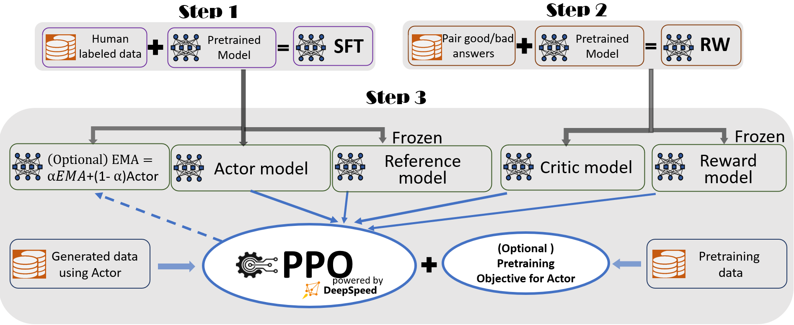

# Reinforcement Learning from human feedback (RLHF) finetuning



In our research, we tackled two main challenges during the RLHF fine-tuning process:

- How to handle the large memory consumption across multiple models?
- How can one efficiently generate answers, as this typically dominates the training cost in RLHF?

  Below, we will address both questions with solutions based on our experience using DeepSpeed-RLHF.

#### **Memory management in DeepSpeed-RLHF**

To reduce memory pressure during RLHF fine-tuning, we employed three key techniques:

- ​**ZeRO Optimization**​: Thanks to DeepSpeed's ZeRO optimization, we were able to partition both the model parameters and optimizers across the entire GPU system, significantly reducing the memory consumption needed for training large models.
- ​**Reference Model Offloading**​: The reference model, which is the same size as the actor model in the PPO training loop, requires considerable memory. However, it is only used when calculating the "old behavior probability," thus its computational cost is lower than that of the actor model. To further alleviate memory pressure, we offload the reference model to CPU. This approach did not show significant throughput degradation compared to keeping it on the GPU, provided that only the reference model was offloaded. Offloading the actor model, however, led to a noticeable slowdown in training.
- ​**LoRA Implementation**​: The optimizer's states consume a large amount of memory during training. To mitigate this, we utilized LoRA, which updates only a small portion of the parameters during training, resulting in much smaller optimization states compared to standard training methods.

#### **DeepSpeed Hybrid Engine**

n most high-optimized systems, training and inference typically use different backends. Training is for model updates, and inference is for deployment. However, RLHF fine-tuning presents a unique case: the actor model needs to generate answers for each query during each step, which makes standard training mode inefficient for RLHF fine-tuning.

Furthermore, although ZeRO optimization allows us to partition the model across GPUs, gathering parameters for each generation step across multiple GPUs or nodes incurs high communication costs, especially for large models.

To overcome these challenges, we introduced the ​**DeepSpeed Hybrid Engine (DeepSpeed-HE)**​. This engine automatically switches between the training and inference modes provided by DeepSpeed, enabling RLHF fine-tuning to benefit from both optimizations. Additionally, DeepSpeed-HE seamlessly switches ZeRO-3 training mode to Tensor Parallelism (also known as Model Parallelism) for inference, eliminating the need to gather parameters repeatedly and improving inference efficiency. This allows users to import Hugging Face models directly for training without needing modifications for tensor or pipeline parallelism.

## How to train RLHF

We provide several actor training scripts in the `training_scripts` folder, all using the fixed OPT-350M reward model. However, users are encouraged to experiment with different reward model sizes based on their requirements. For instance, to train an OPT-1.3B model with a single GPU, you can use the following script:

```bash
training_scripts/single_gpu/run_1.3b.sh
```

## 🎵 Some arguments explanation and largest model training on your own system

We provide most of unique arguments used in DeepSpeed RLHF other than the previous two steps here.

| Args                                                               | Explanation                                                                                  | Note                                                                                                                                                                     |
| ------------------------------------------------------------------ | -------------------------------------------------------------------------------------------- | ------------------------------------------------------------------------------------------------------------------------------------------------------------------------ |
| --unsupervised_dataset_name and --unsupervised_dataset_config_name | Huggingface datasets standard setting to collect the data, e.g., using Wikitext-103          | When both are provided, during each PPO training, we will also add the pretraining objective. Based on InstructGPT, this will enhance the model's benchmark performance. |
| --unsup_coef                                                       | Used to balance RLHF/PPO loss and the unsupervised loss                                      |                                                                                                                                                                          |
| --per_device_train_batch_size and --per_device_mini_batch_size     | The first one is the generation batch size and the second one is the PPO training batch size | Usually, the first one needs to be divisbale by the first one.                                                                                                           |
| --generation_batch_numbers                                         | Generated N batches then do PPO training                                                     | This setting is common in RL, i.e., we generate an experiment table then do RL training                                                                                  |
| --ppo_epochs                                                       | For the generated experiments, how many PPO epochs we want to perform                        |                                                                                                                                                                          |
| --max_prompt_seq_len and --max_answer_seq_len                      | The length of the query and the length of the answer                                         |                                                                                                                                                                          |
| --enable_hybrid_engine                                             | Enable it to use DeepSpeed Hybrid Engine                                                     | This will significantly speedup your training                                                                                                                            |
| --inference_tp_size                                                | The inference tensor parallelism size                                                        | Normally, do not exceed the size of a single node                                                                                                                        |
| --release_inference_cache                                          | Release the memory reserved for sentence generation                                          | This will slow down the training a bit but perhaps increasing the training batch size.                                                                                   |
| --unpin_actor_parameters                                           | Do not gather the actor parameter for generation                                             | This will significantly slow down the generation phase. Usually we do not recommand this option.                                                                         |
| --offload_reference_model                                          | Only offload the reference model to CPU                                                      | This helps increase the batch size with neglible time cost                                                                                                               |
| --enable_ema                                                       | Add another model to collect the expotential moving average of the actor model's weight      | According to InstructGPT, the EMA weight has better performance than actor model's final checkpoint                                                                      |

Theoretically, the largest model you can train for this step is similar to the step-1 SFT finetuning if you enable

- zero stage 3 (if you use multiple GPUs)
- gradient checkpoint
- LoRA
- reference model offloading.

However, in practice, we recommend using the "Total GPU Memory in GB / 6" formula to estimate the upper bound on the sum of the actor model and reward model parameters for safety. Users are welcome to test their system’s real limits.

## How to evaluate

To evaluate the model, users can either use the `prompt_eval.py` script from Step 1 of the SFT process for Q&A quality testing or explore the proof-of-concept multi-round conversation API for more extensive evaluation.

## Instablity of RLHF training and others

RLHF is a relatively new field, and we encountered some training instabilities during our experiments. We are actively working on solutions and welcome contributions from the community.

We discovered that using mismatched generation training batch sizes (`--per_device_train_batch_size`) and PPO training batch sizes (`--per_device_mini_batch_size`), multiple PPO epochs (`--ppo_epochs`), or multiple generation batch sizes (`--generation_batch_numbers`) led to instability. Specifically, we observed that updating the actor model multiple times after generating experimental data caused the model to diverge. In our successful runs, we kept `per_device_train_batch_size=per_device_mini_batch_size` and `ppo_epochs=generation_batch_numbers=1`, which seemed to stabilize training. We suspect that the issue is linked to the rapid divergence of `log_probs` and `old_log_probs`, resulting in an excessively large `ratio`. Although setting an upper bound helped, it did not fully resolve the issue.

We also experimented with adding unsupervised training using a coefficient (`--unsup_coef=27.8`) from InstructGPT, but this caused instability. While unsupervised training primarily improves performance on standard benchmarks, it did not seem to affect RLHF performance significantly in our case. We did not focus much on tuning this parameter.

**Other Considerations**

Evaluating RLHF-trained models can be challenging. Researchers often rely on annotators or pre-trained models like ChatGPT or GPT-4 for quality assessment. Currently, there is no standard evaluation metric for RLHF, and we have not provided one for our fine-tuned model.

Please note that the hyperparameters we used have not undergone extensive tuning. Users and practitioners are encouraged to experiment and find the optimal configurations for their specific needs.
